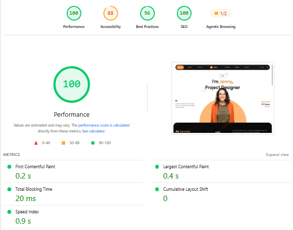
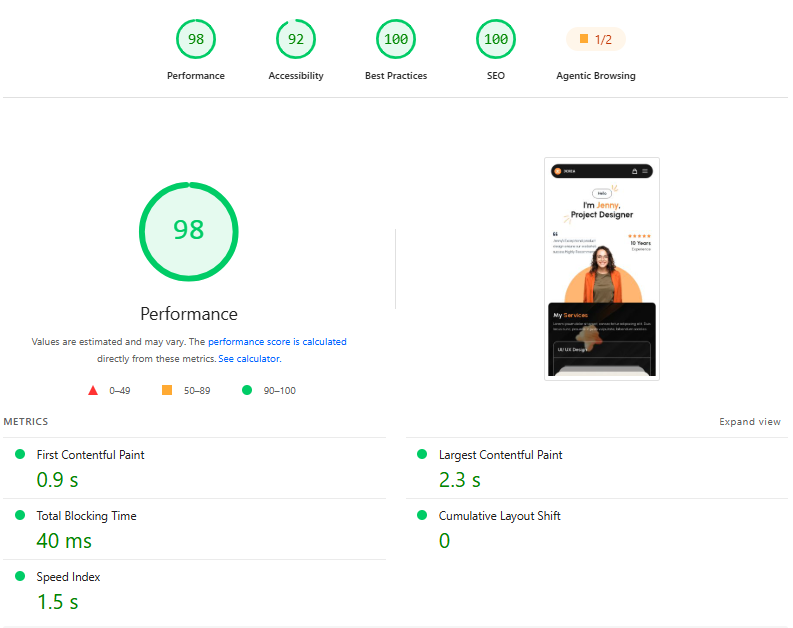

# JCREA — React Frontend Assessment

## 1. Description:

A modern, responsive mini e-commerce site built with Next.js-v16 and
TypeScript, featuring Google OAuth authentication, product inventory management,
and a global cart system. The project focuses on pixel-accurate Figma
implementation and production-ready frontend architecture.

---

## 2. Tech Stack:

- Next.js v16 – App Router
- TypeScript – Type-safe, maintainable code
- Tailwind CSS v4 – Modern responsive styling
- NextAuth.js v5 – Google OAuth authentication
- Zustand - Global state management and cart persistence
- Vercel - Deployment

---

## 3. Main Features:

- Dynamic imports and performance optimization
- Pixel-accurate, responsive Figma implementation
- Google OAuth authentication with NextAuth.js
- **Fast, Lightweight & SEO-Optimized** – Built for high GTmetrix and Lighthouse
  scores (100%).
- Protected dashboard routes with middleware (proxy.ts) 
- Internal mock Product API with TypeScript data types
- Inventory status handling: Out of Stock, Low Stock, and Normal Stock
- Global cart management with Zustand
- Optimistic cart count updates
- Simulated checkout flow with authentication verification
- Checkout loading, success, failure, and retry states
- Skeleton loaders for product fetching
- Meaningful empty-state UI
- Success and error toast notifications
- Persistent cart state using Zustand persist middleware

---

## 4. Live Demo

**Live Demo:** https://jcrea-assesment.vercel.app

---

## 5. Dependencies:

```json
"dependencies": {
    "next": "16.3.0",
    "next-auth": "^5.0.0-beta.32",
    "react": "19.2.8",
    "react-dom": "19.2.8",
    "react-hook-form": "^7.85.0",
    "react-hot-toast": "^2.6.0",
    "react-icons": "^5.7.0",
    "swiper": "^14.1.0",
    "zustand": "^5.0.15"
  },
```

---

## 6. devDependencies:

```json
"devDependencies": {
    "@tailwindcss/postcss": "^4",
    "@types/node": "^20",
    "@types/react": "^19",
    "@types/react-dom": "^19",
    "eslint": "^9",
    "eslint-config-next": "16.3.0",
    "tailwindcss": "^4",
    "typescript": "^5"
  }
```

---

## 7. Bonus Features Completed

- Edge-level route protection
- Performance / Code Splitting
- Cart Persistence

---

## 8. Tech Decisions

### Why Zustand?

Zustand was selected for global state management because the application
primarily requires a lightweight global cart store.

Compared with Redux, Zustand requires less boilerplate while still providing:

- Global state access
- Simple actions
- Easy state updates
- Persistence middleware
- Minimal setup

For this assessment, Zustand provides the required functionality while
keeping the application architecture simple and maintainable.

---

## 9. Lighthouse Report

The production build was tested using Google Lighthouse on both desktop and mobile configurations.

| 🖥️ Desktop | 📱 Mobile |
|:---:|:---:|
|  |  |

---

## 10. Installation:

```bash
# Clone the repository
git clone https://github.com/towfiq-islam/assessment-pillar-2.git

# Navigate into the project
cd assessment-pillar-2

# Create a `.env.local` file in root and put the environment variable there.
NEXTAUTH_URL=http://localhost:3000
NEXTAUTH_SECRET=nextAuth-secret
GOOGLE_CLIENT_ID=google-client-id
GOOGLE_CLIENT_SECRET=google-client-secret

# Install dependencies
npm install

# Run the development server
npm run dev
```

---

## 11. Usage:

Run `npm run dev` to start the project locally. The app will run on
**http://localhost:3000**
